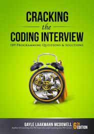
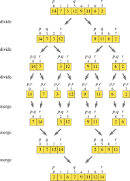
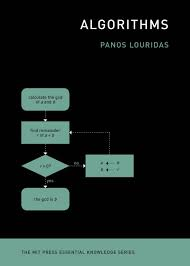

# Data-Statuctures and Problem Challenges

1. [Cracking-Coding-Interview using javascript challenge](https://github.com/cleophasmashiri/cracking-coding-interview-js).
  

 
---

2. [Data Structures Algorithms Practice js](https://github.com/cleophasmashiri/data-structures-algorithms-practice-js).
  

  

2. [Data Structures Algorithms Java tdd](https://github.com/cleophasmashiri/data-structures-algorithms-java-tdd).
  

